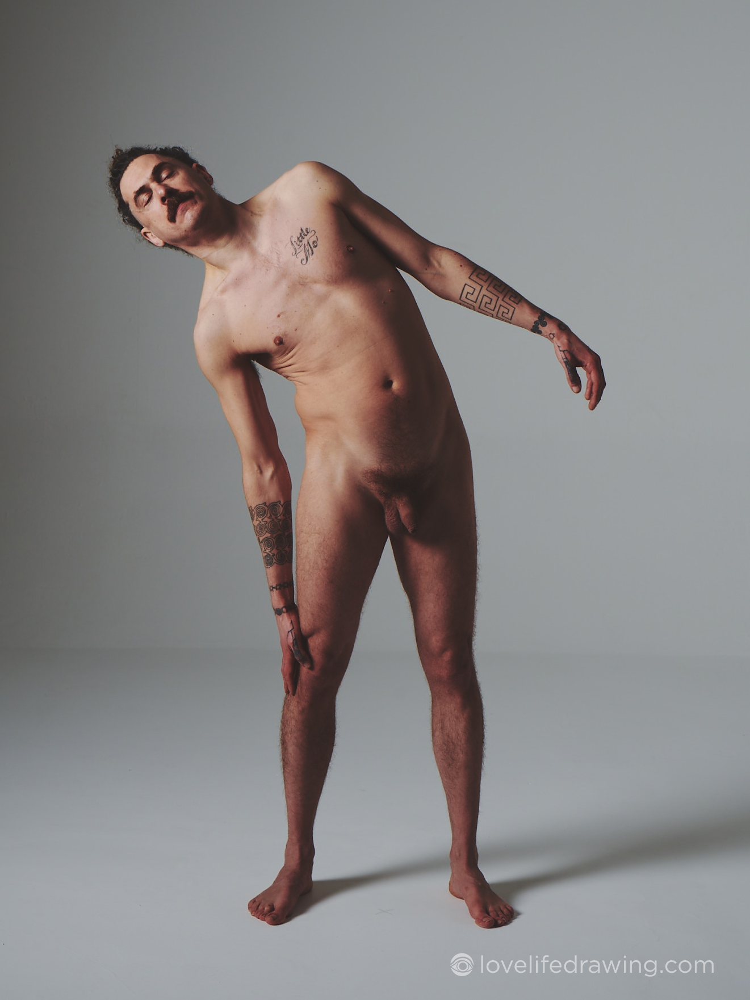
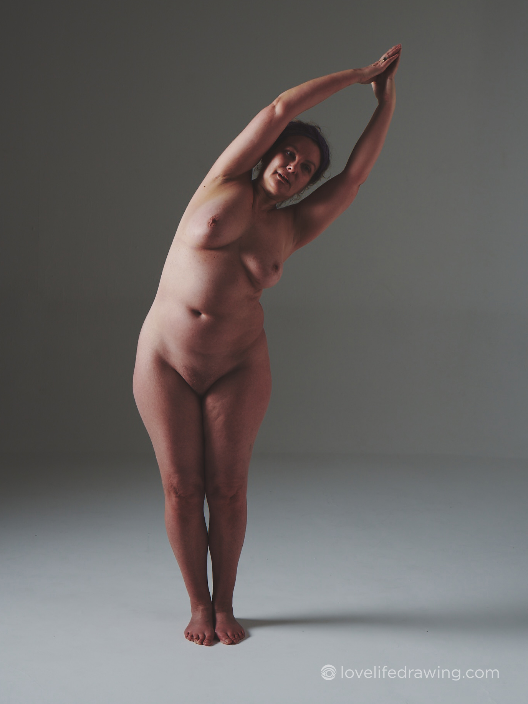
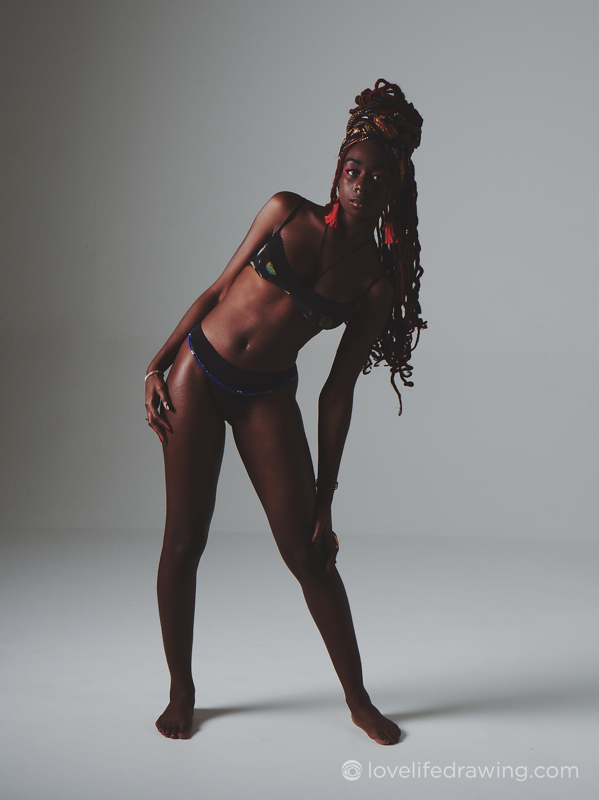
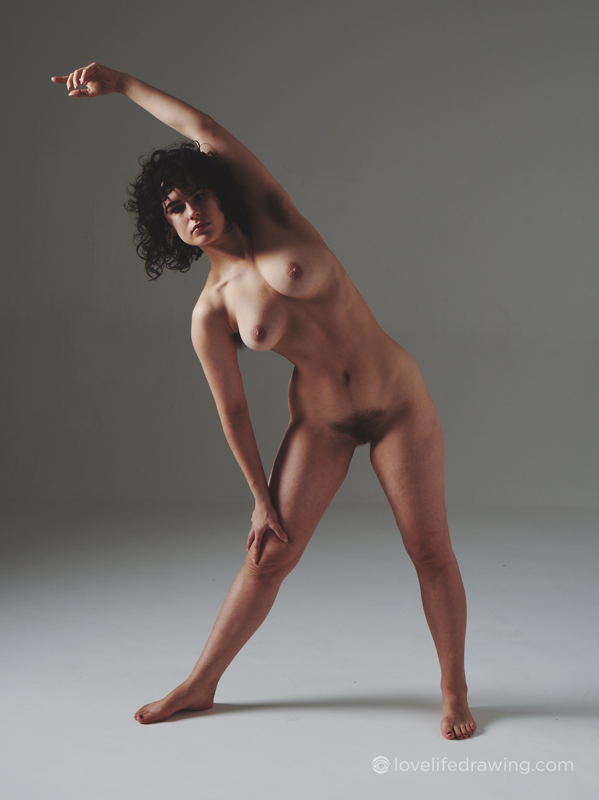
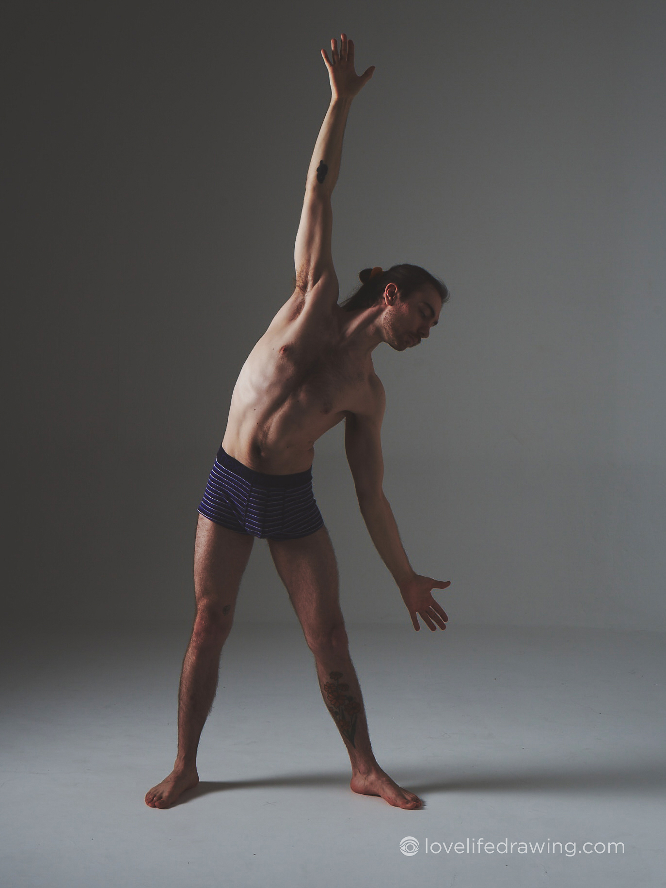

# Tutorial 1: The Fresh Eyes 2D model
The first thing to do is watch the tutorial (if you have a moment to click through to 'Watch on Youtube', it would really help us out if you leave a like and a comment!).

## Exercise 1
Your mission for today is to recreate the 5 poses at the bottom of this page using the Fresh Eyes 2D model for the front view as seen in the tutorial. You can download the 2D model below.

There's a few different things to figure out on this first day of the challenge. Just post in the community if you're unsure about anything.

**Optional extra Day 1 exercise**: Once you have recreated the poses using the 2D model, draw these 5 poses in terms of the 2D model shapes. We aren't going for artistic beauty here, we are going for training our eyes!

So to summarise, this is today's exercise:

## 2D model downloads (front view)
We have created the 2D models in a few different file types so you can use whichever version suits you best. Of these, the most fiddly and awkward is the Google drawings version, so try other versions before that.

* **Printable paper version**: [HERE](./assets/Fresh%20Eyes%20paper%20version%20-%20male.PNG) (male) and [HERE](./assets/Fresh%20Eyes%20paper%20version%20-%20female.PNG) (female)
* **Procreate (this is an iPad app)**: [HERE](./assets/Fresh_Eyes_Male_V1.1.procreate) (male) and [HERE](./assets/Fresh_Eyes_Female_V1.1.procreate) (female)
* **Google Drawings**: click on the links here and then click 'make a copy' when prompted: [HERE](https://docs.google.com/drawings/d/1eDV5aJZx8GV5NaypgxRFCb2xCCNmYkdP6cBN9mBcTVc/copy) (male) and [HERE](https://docs.google.com/drawings/d/1d8fIiNApoRcEtRPLkcOxI5Z-7ormUPThuU8FUGj5IbE/copy) (female). Important note: if 'Snap to Guides' is turned on, turn it off! (View - Snap to - make sure 'Guides' is not ticked).
* **Photoshop**: [HERE](./assets/Fresh_Eyes_Male.psd) (male) and [HERE](./assets/Fresh_Eyes_Female.psd) (female)
* **Just draw!**: If none of the above options work for you, you can just draw out your version of the 2D models for each pose, trying to keep the shapes as they are (see the sketch on the right side of the image below for an example).

## How to use the Procreate, Photoshop, Paper and Google Drawings files

The video above shows how to use the Procreate version of the model. The Photoshop version should be very similar. (I unfortunately lost my voice before recording this so I don't sound very well, even though I actually felt great!).

In Procreate, it's best to turn off 'snapping', so when using transform tool, go to snapping at the bottom left and toggle off 'magnetics'. This way it's easier to get the exact angle and position you need.

## The Paper version
To use the paper versions, simply print it out, cut out the shapes, and start arranging them to match each pose. Once done, snap a photo. You can then reuse the shapes for the next pose. I found the collarbone and neck muscle shapes to be so thin that it was very fiddly applying them in the paper version. I ended up using tweezers! You could also use something more substantial than paper for those thin shapes, like matchsticks or cut the shapes out with card. Here is a photo of my efforts with the paper model:

## The Google Drawings version
Click on the Google drawing link in the '2D models downloads' section above for the model you need. You would need a Google account to use the Google drawing versions. You'll be prompted to 'make a copy' of the file, so please do make a copy. Then you'll see all the shapes there. Important note: if 'Snap to Guides' is turned on, turn it off! (Go to View - Snap to - make sure 'Guides' is not ticked).

You can drag them across to the left side of the canvas, and start to arrange them. I'd recommend starting from the torso and working out from there.

## How to find the angles of the ribcage, pelvis and shoulders
If you are unsure about how to see the angle of the ribcage, pelvis and shoulders, then here is a video to help you. (I unfortunately lost my voice before recording this so I don't sound very well, even though I actually felt great!).

## Model Reference Images for Exercise 1

## Guidelines for using the photographs

### Please do:
* Draw and paint these references for your practice or to create finished artwork
* Share your drawings and paintings with the world and online - tag us (@kenzoandmayko) if posting to Instagram
* Spread the word and tell your friends to sign up and draw here too :)
* Edit the photographs to make them better references for your own drawings or paintings

### Please don't:
* Share the photographs themselves with anyone else or online
* Incorporate the photographs themselves in your artwork: these images are to be used for reference only

If you have any questions, email me!
