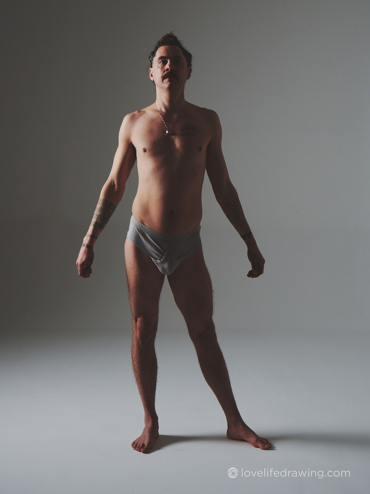
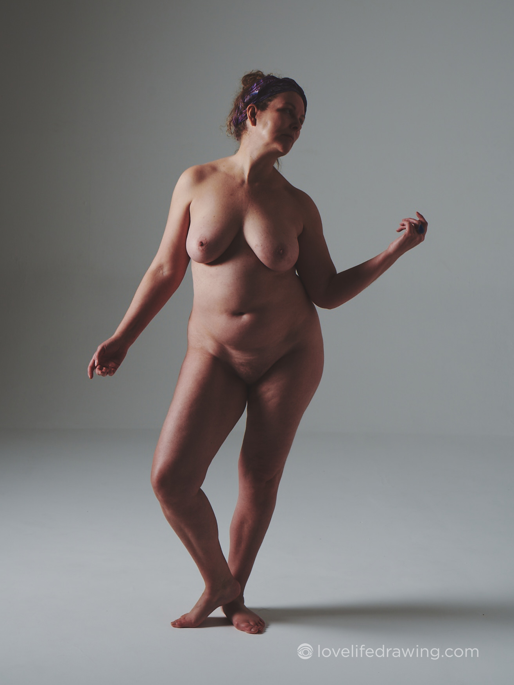
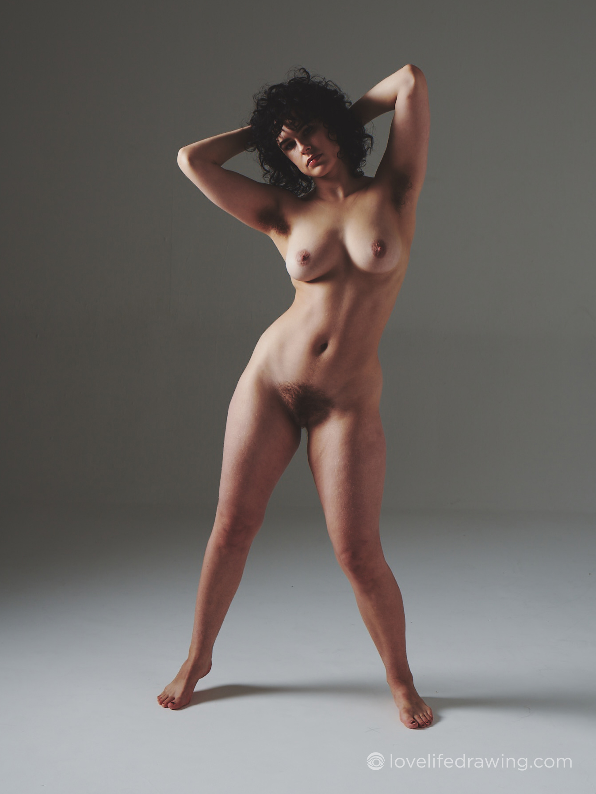
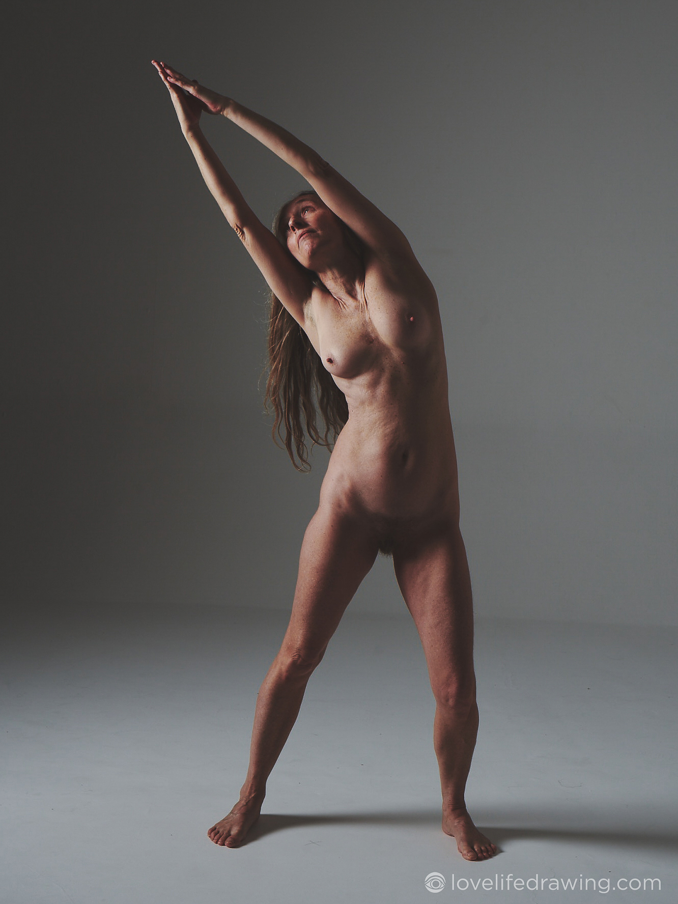
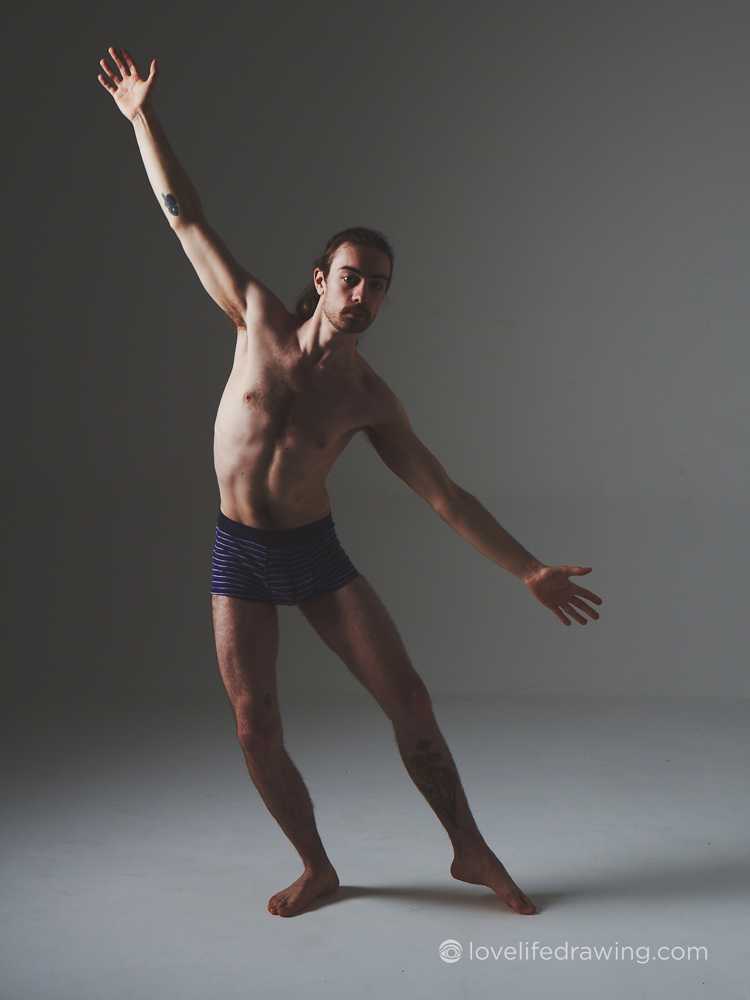

# Tutorial 2
Today we are again recreating 5 front poses using the 2D model. These poses are a little trickier than yesterday's. I noticed for yesterday’s exercise, most people straightened the ribcage, pelvis or head/neck a little bit. Today, let's get those angles nice and strong. 

Hold up your pencil to the line down the middle of the chest and see that ribcage angle and recreate it without reducing it. Same for the pelvis. If the head is off at an angle, capture that angle! Your brain will pull you towards a vertical torso with the head vertically on top, but you can bypass that and capture the angles your eyes see instead.

Also, today everyone should draw the 5 poses in terms of the 2D model shapes.

Optional extra exercise: Create a dynamic front pose from imagination using the 2D model and your understanding of balance and the figure's structure. Then, draw that imaginary pose.

Tomorrow we will move on to the equally important side view!

## Today's live session recording
This is a recording of the Day 2 live session. It's an optional session in case you wanted more clarity about days 1 and 2. I looked over work from community members and addressed common struggles and various ideas about why these shapes are so important to your future drawings.

## Model Reference Images

## Guidelines for using the photographs

### Please do:
* Draw and paint these references for your practice or to create finished artwork
* Share your drawings and paintings with the world and online - tag us (@kenzoandmayko) if posting to Instagram
* Spread the word and tell your friends to sign up and draw here too :)
* Edit the photographs to make them better references for your own drawings or paintings

### Please don't:
* Share the photographs themselves with anyone else or online
* Incorporate the photographs themselves in your artwork: these images are to be used for reference only

If you have any questions, email me!
